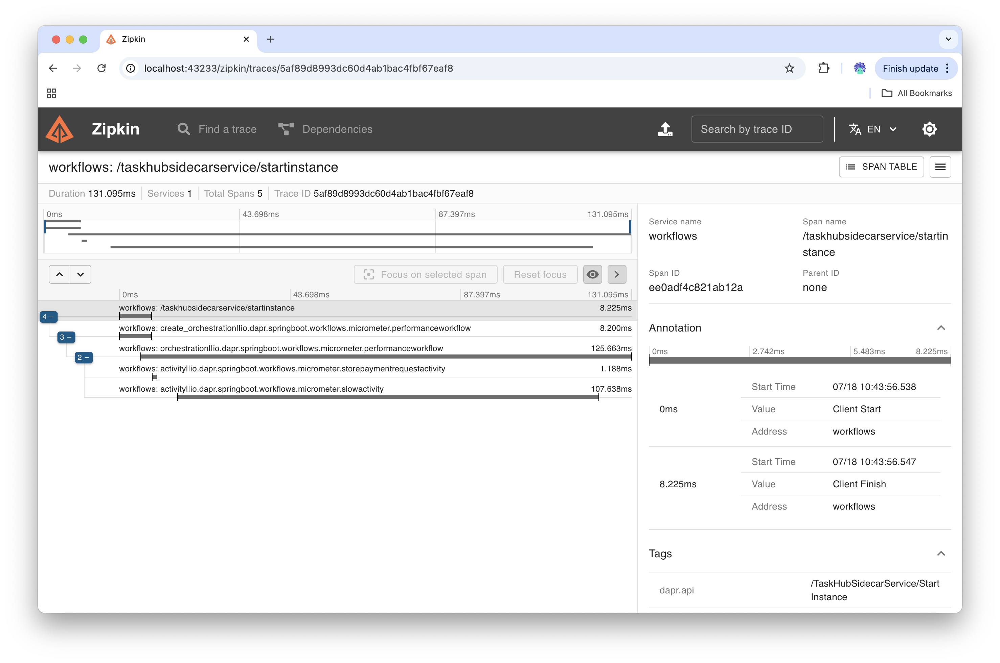

# Workflow Patterns with Spring Boot

This repository includes a set of workflow patterns and examples that shows how to use Dapr Workflow with Spring Boot applications. 

The `workflows` application can be started by running the following commands for local development: 

```
cd workflows/
mvn spring-boot:test-run
```

**Note:** If you want to run this examples against Diagrid's Catalyst, you need to comment out the following line in the `application.properties` file located in `src/test/resources/`:

```
#comment out to run tests against Catalyst
tests.dapr.local=true
```

You can set your Catalyst ENV Variables or set the following Spring Boot Application properties: 

In your `application.properties` file: 
```
dapr.client.httpEndpoint=<Your Catalyst Project HTTP Endpoint>
dapr.client.grpcEndpoint=<Your Catalyst Project GRPC Endpoint>
dapr.client.apiToken=<Your Catalyst APP ID API Token>
```

## Observability

The Zipkin container is started and configured for Dapr to send traces from the application. 

Because Zipkin is started with Testcontainers, to find the exposed ports you will need to run: 

```
docker ps
```

Find the Zipkin container and check for the mapped port on localhost:

```
CONTAINER ID  IMAGE                                  COMMAND               CREATED         STATUS                   PORTS                                                       NAMES
fd9e08addd6f  docker.io/testcontainers/ryuk:0.11.0   /bin/ryuk             34 seconds ago  Up 35 seconds            0.0.0.0:41353->8080/tcp                                     testcontainers-ryuk-2bfe7007-c07b-4a37-bfc9-4f6fdec11e84
490036349a1f  docker.io/confluentinc/cp-kafka:7.5.0  -c while [ ! -f /...  34 seconds ago  Up 35 seconds            0.0.0.0:34275->2181/tcp, 0.0.0.0:33459->9093/tcp, 9092/tcp  gifted_williamson
711c83bfd445  docker.io/openzipkin/zipkin:latest                           32 seconds ago  Up 32 seconds (healthy)  0.0.0.0:38517->9411/tcp, 9410/tcp                           reverent_brahmagupta
85078f4b20db  docker.io/daprio/placement:1.15.4      ./placement -port...  30 seconds ago  Up 30 seconds            0.0.0.0:45027->50005/tcp                                    cranky_gould
8cc6565f609d  docker.io/daprio/scheduler:1.15.4      ./scheduler --por...  30 seconds ago  Up 30 seconds            0.0.0.0:33689->51005/tcp                                    confident_margulis
eb61eafd25e5  docker.io/testcontainers/sshd:1.2.0    echo ${USERNAME}:...  29 seconds ago  Up 30 seconds            0.0.0.0:33429->22/tcp                                       nifty_lederberg
07e10c2ef589  docker.io/daprio/daprd:1.15.4          ./daprd --app-id ...  29 seconds ago  Up 29 seconds            0.0.0.0:36415->3500/tcp, 0.0.0.0:41827->50001/tcp           cool_diffie
f24ccad95619  quay.io/microcks/microcks-uber:1.11.2                        28 seconds ago  Up 28 seconds            0.0.0.0:44195->8080/tcp, 0.0.0.0:41255->9090/tcp            modest_shaw

```

For this example: `711c83bfd445  docker.io/openzipkin/zipkin:latest -> 0.0.0.0:38517->9411/tcp`, the `MAPPED_PORT` is `38517`

Then to access the Zipkin instance, point your browser to http://localhost:`<MAPPED_PORT>`/

 

## Patterns

The `workflows` Maven project contains different workflow patterns showing also some integration patterns and Dapr workflow features. 

- [Simple HTTP endpoint with Activity Retry Policies Example](#simple-http-with-retry-policies-example) (`simplehttp`)
- [Async Kafka producer and consumer Example](#async-kafka-producer-and-consumer-example) (`asynckafka`)
- [Async PubSub producer and consumer Example](#async-pubsub-producer-and-consumer-example) (`asyncpubsub`)
- [Simple Timer Example](#simple-timer-example) (`simpletimer`)
- [Compensate On Error Example](#compensate-on-error-example) (`compensanteonerror`)
- [Async Tasks Example](#async-tasks-example) (`asynctasks`)
- [Fire and forget Example](#fire-and-forget-example) (`fireandforget`)
- [Suspend and Resume Example](#suspend-and-resume-example) (`suspendresume`)
- [Suspend and Resume with Timer Example](#suspend-and-resume-with-timer-example) (`suspendresumetimer`)
- [ZoneDateTime Timer Example](#zonedatetime-timer-example) (`zoneddatetime`)
- [SaveState Workflow Example](#savestate-workflow-example) (`savestate`)
- [Terminate Workflow Example](#terminate-workflow-example) (`terminate`)
- [Raise Multiple Events that are not waited on](#raise-multiple-events-that-are-not-being-waited-on)(`raisemultievent`)
- [Recording Operations with Micrometer](#recording-operations-with-micrometer)(`micrometer`)
- [Multi Retries with Compensation and Timeout exceptions](#multi-retries-with-compensation-and-timeout-exceptions)(`multiretry`)

### Simple HTTP with retry policies Example

This example shows a workflow with a single activity that performs a remote HTTP endpoint call. This activity is configured to retry if the HTTP endpoint call fails. 

Once the application is running, you can invoke the endpoint using `cURL` or [`HTTPie`](https://httpie.io/).

```bash
http :8080/simplehttp/start id="123" customer="salaboy" amount=10
```

As soon as the workflow is started, you get a response back containing the `workflowInstanceId` set: 

```bash
{
    "amount": 10,
    "customer": "salaboy",
    "id": "123",
    "processedByExternalAsyncSystem": false,
    "processedByRemoteHttpService": false,
    "workflowInstanceId": "2ea091b4-5f26-45eb-b414-7a62f6d9816e"
}
```

In the application logs you can see how the activity retries the HTTP call until the remote services returns a `200` response:

```
io.dapr.durabletask                      : Performing retires based on policy
io.dapr.durabletask                      : 1 retries out of total 2 performed
i.d.s.w.s.MakePaymentRequestActivity     : Payment Result: AuditPaymentPayload{paymentRequestId='123', customer='salaboy', amount=10, message='Salaboy's payment'}

...
io.dapr.workflows.WorkflowContext        : Payment request: PaymentRequest{id='123', customer='salaboy', amount=10, processedByRemoteHttpService=true, processedByExternalAsyncSystem=false, workflowInstanceId='null'} sent to payment service.
```
The important bit of information here is the `processedByRemoteHttpService=true` property that is set by the activity that calls the remote HTTP endpoint after obtaining a result from the endpoint.


### Async Kafka producer and consumer Example

This workflow consist on an activity that produce a Kafka message into a Kafka topic and a WaitForExternal event activity. 

The workflow is complemented by a KafkaListener that consume messages from a topic and then raise a workflow event using the workflowInstanceId to target the right workflow instance. 

Once the application is running, you can invoke the endpoint using `cURL` or [`HTTPie`](https://httpie.io/).

```bash
http :8080/asynckafka/start id="123" customer="salaboy" amount=10
```

The applications logs should show something similar to: 

```
io.dapr.workflows.WorkflowContext        : Let's send the payment request to an async external system: 123
i.d.s.w.a.SendPaymentAsyncSystemActivity : Placing a kafka message from Activity: io.dapr.springboot.workflows.asynckafka.SendPaymentAsyncSystemActivity
i.d.s.w.a.AsyncKafkaRestController       : Workflow instance a8eae19e-6bf5-4468-81d3-315b5bb2565e started

...
i.d.s.w.a.ExternalKafkaMessageListener   : Payment request approval requested: 123
io.dapr.workflows.WorkflowContext        : Let's wait for external (async) system to get back to us: 123
...
io.dapr.workflows.WorkflowContext        : Payment was processed and event arrived: 123
```

### Async PubSub producer and consumer Example

This workflow consist on an activity that produce a message using the Dapr PubSub API and a WaitForExternal event activity. 

The workflow is complemented by a RestEndpoint that  is subscribed (with a Dapr Subscription) to consume messages from a topic and then raise a workflow event using the workflowInstanceId to continue the right workflow instance. 

Once the application is running, you can invoke the endpoint using `cURL` or [`HTTPie`](https://httpie.io/).

**Note**: to run this with Catalyst you need to:
- Start the application with a dev tunnel `diagrid dev run --project <PROJECT_ID> --app-id <APP_ID> --app-port 8080 mvn spring-boot:test-run`
- Create a Catalyst Subscription with the following details: 
  - Subscription Name: `pubsub-subscription`
  - PubSub Component: `pubsub`
  - Scopes: select <APP_ID>
  - Topic: `pubsubTopic`
  - Default Route: `/asyncpubsub/continue`

```bash
http :8080/asyncpubsub/start id="123" customer="salaboy" amount=10
```
You should see the response back from the server similar to: 

```bash
HTTP/1.1 200 
Connection: keep-alive
Content-Type: application/json
Date: Thu, 29 May 2025 09:11:37 GMT
Keep-Alive: timeout=60
Transfer-Encoding: chunked

{
    "amount": 10,
    "customer": "salaboy",
    "id": "123",
    "processedByExternalAsyncSystem": false,
    "processedByRemoteHttpService": false,
    "updatedAt": [],
    "workflowInstanceId": "31b4a139-a9c3-420d-bb45-6282d1bd1053"
}
```

The applications logs should show something similar to: 

```bash
io.dapr.workflows.WorkflowContext        : Let's send the payment request to an async external system: 123
i.d.s.w.a.AsyncPubSubRestController      : Workflow instance 31b4a139-a9c3-420d-bb45-6282d1bd1053 started
i.d.s.w.a.SendPaymentViaPubSubActivity   : Placing a PubSub message from Activity: io.dapr.springboot.workflows.asyncpubsub.SendPaymentViaPubSubActivity
io.dapr.workflows.WorkflowContext        : Let's wait for external (async) system to get back to us: 123

...


i.d.s.w.a.AsyncPubSubRestController      : Payment request approval requested: 123
io.dapr.workflows.WorkflowContext        : Payment was processed and event arrived: 123

```

### Simple Timer Example

This workflow shows how a timer can be used to wait for a consistent amount of time before moving to the next workflow activity. 
The workflow consist of three steps: 
- ModifyPaymentRequestActivity
- Timer wait for 10 seconds
- ModifyPaymentRequestActivity

The PaymentRequest payload stores the timestamps when the activities where executed, allowing us to validate that the timer was triggered at the right time.

Once the application is running, you can invoke the endpoint using `cURL` or [`HTTPie`](https://httpie.io/).

```bash
http :8080/simpletimer/start id="123" customer="salaboy" amount=10
```

You should see a response back from the server similar to: 
```bash
HTTP/1.1 200 
Connection: keep-alive
Content-Type: application/json
Date: Thu, 29 May 2025 09:14:46 GMT
Keep-Alive: timeout=60
Transfer-Encoding: chunked

{
    "amount": 10,
    "customer": "salaboy",
    "id": "123",
    "processedByExternalAsyncSystem": false,
    "processedByRemoteHttpService": false,
    "updatedAt": [],
    "workflowInstanceId": "eb3c82ec-0ffb-421f-9a01-0297bd562f30"
}
```

The application logs should look similar to: 

```bash
io.dapr.workflows.WorkflowContext        : Let's Update the Payment Request: 123
i.d.s.w.s.TimersRestController           : Workflow instance eb3c82ec-0ffb-421f-9a01-0297bd562f30 started
i.d.s.w.s.UpdatePaymentRequestActivity   : PaymentRequest updated at: [Thu May 29 10:14:46 WEST 2025]
io.dapr.workflows.WorkflowContext        : Payment request: PaymentRequest [id=123, customer=salaboy, amount=10, processedByRemoteHttpService=false, processedByExternalAsyncSystem=false, workflowInstanceId=null, updatedAt=[Thu May 29 10:14:46 WEST 2025]] updated.

...

io.dapr.workflows.WorkflowContext        : Timer completed
io.dapr.workflows.WorkflowContext        : Let's Update the Payment Request: 123
i.d.s.w.s.UpdatePaymentRequestActivity   : PaymentRequest updated at: [Thu May 29 10:14:46 WEST 2025, Thu May 29 10:14:56 WEST 2025]
io.dapr.workflows.WorkflowContext        : Payment request: PaymentRequest [id=123, customer=salaboy, amount=10, processedByRemoteHttpService=false, processedByExternalAsyncSystem=false, workflowInstanceId=null, updatedAt=[Thu May 29 10:14:46 WEST 2025, Thu May 29 10:14:56 WEST 2025]] updated.

```

If you inspect the output, you will see that the second time that the activity is executed happens 10 seconds after the first execution. Check the timestamps: `updatedAt=[Thu May 29 10:14:46 WEST 2025, Thu May 29 10:14:56 WEST 2025]]`

### Event Timeout Workflow Example

This workflow shows how to deal with waitForExternalEvent timeouts. This example shows how to execute an activity if the 
duration specified for waiting an event times out. If the time out happens, for this example a new activity is called.

Once the application is running, you can invoke the endpoint using `cURL` or [`HTTPie`](https://httpie.io/).

```bash
http :8080/timeoutevent/start id="123" customer="salaboy" amount=10
```

You should see a response back from the server similar to: 
```bash
HTTP/1.1 200 
Connection: keep-alive
Content-Type: application/json
Date: Thu, 29 May 2025 12:51:42 GMT
Keep-Alive: timeout=60
Transfer-Encoding: chunked

{
    "amount": 10,
    "customer": "salaboy",
    "id": "123",
    "processedByExternalAsyncSystem": false,
    "processedByRemoteHttpService": false,
    "recoveredFromTimeout": false,
    "updatedAt": [],
    "workflowInstanceId": "b49cc4f8-fe0e-4d3a-9759-f0031f76749c"
}
```

The application logs should look similar to: 

```bash
io.dapr.workflows.WorkflowContext        : Let's wait for external (async) system to get back to us: 123
i.d.s.w.t.TimeoutEventRestController     : Workflow instance b49cc4f8-fe0e-4d3a-9759-f0031f76749c started

...

io.dapr.workflows.WorkflowContext        : Timeout occurred for payment: 123 let's handle it!
i.d.s.w.t.HandleTimeoutActivity          : Handling timeout for payment: 123
io.dapr.workflows.WorkflowContext        : Workflow completed for: 123
```

### Compensate on Error Example

This example shows how to use the CompensationHelper to register compensation activities that can be associated to workflow activities. 
Compensation activities should include the logic to define how the compensation should be performed, this can be by checking that previous operations were performed and then implement how to perform the compensation. 

This example shows a workflow that perform to debit operations from different accounts, if one fails we need to make sure that both accounts end up with the same balance as before the workflow started. 

Once the application is running, you can invoke the endpoint using `cURL` or [`HTTPie`](https://httpie.io/).

```bash
http :8080/compensateonerror/start id="123" customer="other" amount=10
```

The output should show something like: 

```bash
{
    "amount": 10,
    "customer": "other",
    "id": "123",
    "processedByExternalAsyncSystem": false,
    "processedByRemoteHttpService": false,
    "recoveredFromTimeout": false,
    "updatedAt": [],
    "workflowInstanceId": "a08c17b2-d0ed-492e-9c4a-52898c58a844"
}

```
If you look into the application output you should see:

```bash
io.dapr.workflows.WorkflowContext        : Workflow instance a08c17b2-d0ed-492e-9c4a-52898c58a844 started
io.dapr.workflows.WorkflowContext        : Let's debit a payment: 123 for customer: other

//First debit is processed correctly

io.dapr.workflows.WorkflowContext        : Debit request: PaymentRequest [id=123, customer=other, amount=10, processedByRemoteHttpService=false, processedByExternalAsyncSystem=false, recoveredFromTimeout=false, workflowInstanceId=null, updatedAt=[]] sent to payment service.

//Result from remote endpoint
i.d.s.w.c.DebitPaymentRequestActivity    : Debit Payment Result: AuditPaymentPayload{paymentRequestId='123', customer='other', amount=10, message='Other customer's debit'}

//Second debit for an invalid customer will fail

io.dapr.workflows.WorkflowContext        : Let's debit a payment: 456 for customer: salaboy
io.dapr.workflows.WorkflowContext        : Task failed: Task 'io.dapr.springboot.workflows.compensateonerror.DebitPaymentRequestActivity' (#1) failed with an unhandled exception: Invalid Customer! - compensating.

//The compensation kicks in and send a credit request for the first order after checking that the debit was performed
CompensationCreditPaymentRequestActivity : Credit Payment Result: AuditPaymentPayload{paymentRequestId='123', customer='salaboy', amount=10, message='Salaboy's credit'}
CompensationCreditPaymentRequestActivity : Credit PaymentRequest: 123 sent.
```

### Async Tasks Example

This example shows how to use Async Tasks with Dapr Workflows. By default all Tasks are async and handled by [Project Reactor](https://projectreactor.io/) in a separate thread. Tasks are scheduled when the ctx.callActivity() method is used and the workflow developer can choose to wait for the task to complete by blocking the workflow thread or to rely on the async nature of tasks and register a callback for when the tasks is completed.

This example shows a Workflow that schedule two activities, that are chained to each other. This means that: 
- Activity one is scheduled with a callback / promise to call Activity two when Activity one is finished
- Activity two also register a callback to complete the workflow instance when Activity two is finished

To make Activities synchronous developers need to use the `.await()` method to block the thread to move forward. This example shows how can we chain tasks to callbacks / promises. 


Once the application is running, you can invoke the endpoint using `cURL` or [`HTTPie`](https://httpie.io/).
```
http :8080/asynctasks/start id="123" customer="salaboy" amount=10
```

You should see the output similar to this: 
```
HTTP/1.1 200 
Connection: keep-alive
Content-Type: application/json
Date: Wed, 04 Jun 2025 09:56:44 GMT
Keep-Alive: timeout=60
Transfer-Encoding: chunked

{
    "amount": 10,
    "customer": "salaboy",
    "id": "123",
    "processedByExternalAsyncSystem": false,
    "processedByRemoteHttpService": false,
    "recoveredFromTimeout": false,
    "updatedAt": [],
    "workflowInstanceId": "6c30fd18-ae6b-41e2-af83-3bf59c5d94a1"
}
```

In the application output you should see: 
```
io.dapr.workflows.WorkflowContext        : Workflow instance 6d0b91b8-c8d9-4a88-a6ff-7e8d5464a602 started

... // The user has the control back right after the instanceId is obtained

io.dapr.workflows.WorkflowContext        : Let's make a payment: 123 for customer: salaboy

... // The Activity is scheduled but the workflow is not blocking, as a callback/promise has been registered.

i.d.s.w.a.TaskWithAsyncLogicActivity     : Payment Result: AuditPaymentPayload{paymentRequestId='123', customer='other', amount=10, message='Other customer's debit'}
i.d.s.w.a.TaskWithAsyncLogicActivity     : PaymentRequest: 123 sent.

... // When the activity is finished the callback/promise is called and the next Activity is executed using the results of the previous one

io.dapr.workflows.WorkflowContext        : Let's make a payment: 456 for customer: salaboy

... // The second activity is scheduled and a callback/promise is registered to complete the workflow when the second activity is finished

i.d.s.w.a.TaskWithAsyncLogicActivity     : Payment Result: AuditPaymentPayload{paymentRequestId='123', customer='other', amount=10, message='Other customer's debit'}
i.d.s.w.a.TaskWithAsyncLogicActivity     : PaymentRequest: 456 sent.

... // When the second activity is over, the workflow is completed.

io.dapr.workflows.WorkflowContext        : Completing the workflow async, when Activity 2 has finished 
```

### Fire and forget Example

In this example, the workflow executes one blocking (`await()`) activity that creates a request to an HTTP endpoint and wait for the results, followed by two async activities (notifications) that the workflow don't wait for completion. This shows how the workflow engine schedule tasks that are non-blocking. The logs shows how the workflow completes while the notification activities that, on purpouse takes 5 seconds to be executed, are sent after completion. 

Once the application is running, you can invoke the endpoint using `cURL` or [`HTTPie`](https://httpie.io/).

```
http :8080/fireandforget/start id="123" customer="salaboy" amount=10
```

You should see the output similar to this: 
```
HTTP/1.1 200 
Connection: keep-alive
Content-Type: application/json
Date: Thu, 05 Jun 2025 08:39:06 GMT
Keep-Alive: timeout=60
Transfer-Encoding: chunked

{
    "amount": 100,
    "customer": "salaboy21",
    "id": "123",
    "processedByExternalAsyncSystem": false,
    "processedByRemoteHttpService": false,
    "recoveredFromTimeout": false,
    "updatedAt": [],
    "workflowInstanceId": "f8934335-cee6-4e52-8e37-5ee9a35b539c"
}
```

In the application output you should see: 

```bash
io.dapr.workflows.WorkflowContext        : Workflow instance 2e24a9be-e856-47a3-b56c-2b6ba5f3dcec started

... // The first activity calls a remote HTTP endpoint and wait for it response

io.dapr.workflows.WorkflowContext        : Let's make a payment: 123 for customer: salaboy
i.d.s.w.f.TaskWithSyncLogicActivity      : Payment Result: AuditPaymentPayload{paymentRequestId='123', customer='other', amount=10, message='Other customer's debit'}

... // the following two notifications are scheduled in an async fashion and the workflow completes.

io.dapr.workflows.WorkflowContext        : Now that the payment was processed, let's notify the Customer Success Team
io.dapr.workflows.WorkflowContext        : Now that the payment was processed, let's notify the audit team
io.dapr.workflows.WorkflowContext        : Completing the workflow for payment request: PaymentRequest [id=123, customer=salaboy, amount=10, processedByRemoteHttpService=true, processedByExternalAsyncSystem=false, recoveredFromTimeout=false, workflowInstanceId=null, updatedAt=[]]

... // After 5 seconds both notifications will be sent

>> Notification Sent: Notification{id='7a099675-510f-407a-8d88-1b519fd04df6', paymentRequest=PaymentRequest [id=123, customer=salaboy, amount=10, processedByRemoteHttpService=true, processedByExternalAsyncSystem=false, recoveredFromTimeout=false, workflowInstanceId=null, updatedAt=[]], message='Customer Payment completed successfully.'}
>> Notification Sent: Notification{id='b3d48abb-7572-4ae8-9ab0-f3d16fa80f1b', paymentRequest=PaymentRequest [id=123, customer=salaboy, amount=10, processedByRemoteHttpService=true, processedByExternalAsyncSystem=false, recoveredFromTimeout=false, workflowInstanceId=null, updatedAt=[]], message='Customer Payment completed and ready for audit.'}
```

### Suspend and Resume Example

In this example we test the suspend and resume commands for a workflow instance. To validate that the the operations were successful we check on the workflow instance status.

Once the application is running, you can invoke the endpoint using `cURL` or [`HTTPie`](https://httpie.io/).

```sh
http :8080/suspendresume/start id="123" customer="salaboy" amount=10
```

You should see the output similar to this: 
```sh
HTTP/1.1 200 
Connection: keep-alive
Content-Type: application/json
Date: Mon, 09 Jun 2025 14:25:51 GMT
Keep-Alive: timeout=60
Transfer-Encoding: chunked

{
    "amount": 10,
    "customer": "salaboy",
    "id": "123",
    "processedByExternalAsyncSystem": false,
    "processedByRemoteHttpService": false,
    "recoveredFromTimeout": false,
    "updatedAt": [],
    "workflowInstanceId": "f3e669ee-ca8d-4409-a01d-cd2b55de03ad"
}

```

In the application output you should see: 
```sh
io.dapr.workflows.WorkflowContext        : Workflow instance f3e669ee-ca8d-4409-a01d-cd2b55de03ad started
... // The workflow instance starts and wait for an event.
io.dapr.workflows.WorkflowContext        : Let's wait for external (async) system to get back to us: 123
```

Now, we can suspend the workflow instance by running the following command, picking up the workflowInstanceId from the previous command: 

```sh
http PATCH ':8080/suspendresume/suspend?instanceId=f3e669ee-ca8d-4409-a01d-cd2b55de03ad'
```

The application output should show: 

```sh
i.d.s.w.s.ResumeSuspendRestController    : Suspending Workflow Instance: f3e669ee-ca8d-4409-a01d-cd2b55de03ad
```

Now we can resume the workflow instance if we want to continue with the execution:

```sh
http PATCH ':8080/suspendresume/resume?instanceId=f3e669ee-ca8d-4409-a01d-cd2b55de03ad'
```

The application output should show: 

```sh
i.d.s.w.s.ResumeSuspendRestController    : Resuming Workflow Instance: f3e669ee-ca8d-4409-a01d-cd2b55de03ad
```

To finish the instance we can submit the event that the workflow instance is waiting for: 

```sh
http :8080/suspendresume/continue id="123"
```

The application's output should show that the instance was completed after the event was received: 

```sh
i.d.s.w.s.ResumeSuspendRestController    : Payment request continue requested: 123
io.dapr.workflows.WorkflowContext        : Let's call the Log activity for payment: 123
i.d.s.w.s.LogPaymentActivity             : Log payment: PaymentRequest [id=123, customer=salaboy, amount=10, processedByRemoteHttpService=false, processedByExternalAsyncSystem=false, recoveredFromTimeout=false, workflowInstanceId=null, updatedAt=[]]
io.dapr.workflows.WorkflowContext        : Workflow completed for: 123
```

### Suspend and Resume with Timer Example

In this example we test the suspend and resume commands for a workflow instance that creates a timer. We suspend the instance after the timer is created, wait for the timer deadline and then resume. The timer is fired instantly if the timer due date was met when the instance was suspended.

Once the application is running, you can invoke the endpoint using `cURL` or [`HTTPie`](https://httpie.io/).

```sh
http :8080/suspendresume/timer/start id="123" customer="salaboy" amount=10
```

You should see the output similar to this: 

```sh
{
    "amount": 10,
    "customer": "salaboy",
    "id": "123",
    "processedByExternalAsyncSystem": false,
    "processedByRemoteHttpService": false,
    "recoveredFromTimeout": false,
    "updatedAt": [],
    "workflowInstanceId": "b07e6e95-0d19-4e16-82b3-5b6566fe77c0"
}

```

The application's output log should show something like this: 
```
io.dapr.workflows.WorkflowContext        : Workflow instance b07e6e95-0d19-4e16-82b3-5b6566fe77c0 started
io.dapr.workflows.WorkflowContext        : Let's call the Log activity for payment: 123
i.d.s.w.s.LogPaymentActivity             : Log payment: PaymentRequest [id=123, customer=salaboy, amount=10, processedByRemoteHttpService=false, processedByExternalAsyncSystem=false, recoveredFromTimeout=false, workflowInstanceId=null, updatedAt=[]]
io.dapr.workflows.WorkflowContext        : Starting the timer at: Tue Jun 10 08:35:55 HKT 2025

```

Before the 30 seconds timer is due, let's suspend the workflow instance using the `workflowInstanceId` provided by the first command output.

```sh
http PATCH ':8080/suspendresume/suspend?instanceId=b07e6e95-0d19-4e16-82b3-5b6566fe77c0'
```

You should see in the output: 
```sh
i.d.s.w.s.ResumeSuspendRestController    : Suspending Workflow Instance: b07e6e95-0d19-4e16-82b3-5b6566fe77c0
```

Make sure that in the output, doesn't show that the timer has finished. 
Wait for 30 seconds or more and then resume the instance.


```sh
http PATCH ':8080/suspendresume/resume?instanceId=b07e6e95-0d19-4e16-82b3-5b6566fe77c0'
```

You should see that the workflow instance was resumed and that the timer was fired inmediately.

The application's output should show something like this: 

```sh
i.d.s.w.s.ResumeSuspendRestController    : Resuming Workflow Instance: b07e6e95-0d19-4e16-82b3-5b6566fe77c0
io.dapr.workflows.WorkflowContext        : Finishing the timer at: Tue Jun 10 08:40:03 HKT 2025
io.dapr.workflows.WorkflowContext        : Let's call the Log activity for payment: 123
i.d.s.w.s.LogPaymentActivity             : Log payment: PaymentRequest [id=123, customer=salaboy, amount=10, processedByRemoteHttpService=false, processedByExternalAsyncSystem=false, recoveredFromTimeout=false, workflowInstanceId=null, updatedAt=[]]
io.dapr.workflows.WorkflowContext        : Let's wait for external (async) system to get back to us: 123
```

To complete the instance, let's send the event that it is waiting for: 

```sh
http :8080/suspendresume/continue id="123"
```

You should see in the application's output that the workflow instance completed: 

```
i.d.s.w.s.ResumeSuspendRestController    : Payment request continue requested: 123
io.dapr.workflows.WorkflowContext        : Let's call the Log activity for payment: 123
i.d.s.w.s.LogPaymentActivity             : Log payment: PaymentRequest [id=123, customer=salaboy, amount=10, processedByRemoteHttpService=false, processedByExternalAsyncSystem=false, recoveredFromTimeout=false, workflowInstanceId=null, updatedAt=[]]
io.dapr.workflows.WorkflowContext        : Workflow completed for: 123
```


### ZoneDateTime Timer Example

This example shows how to schedule timers for future [ZonedDateTimes](https://docs.oracle.com/javase/8/docs/api/java/time/ZonedDateTime.html), this allows timers to fire on a specific date/time that is specific to a Timezone.  

The example shows how a timer can be scheduled to due at a fixed time in the future. 

Once the application is running, you can invoke the endpoint using `cURL` or [`HTTPie`](https://httpie.io/).

```sh
http :8080/zoneddatetime/start id="123" customer="salaboy" amount=10
```

You should see in the application's output that the workflow instance completed: 

```
io.dapr.workflows.WorkflowContext        : Workflow instance a1d3a3ba-2527-4b5b-88c1-3ca1d14022f0 started
io.dapr.workflows.WorkflowContext        : Let's call the Log activity for payment: 123
i.d.s.w.s.LogPaymentActivity             : Log payment: PaymentRequest [id=123, customer=salaboy, amount=10, processedByRemoteHttpService=false, processedByExternalAsyncSystem=false, recoveredFromTimeout=false, workflowInstanceId=null, updatedAt=[]]
... // Creates a timer for 10 seconds in the future, this includes rounding milliseconds
io.dapr.workflows.WorkflowContext        : Creating a timer that due at: 2025-06-11T11:19:58.954097+08:00[Asia/Hong_Kong]

... // The timer will wait until the specified time to fire

io.dapr.workflows.WorkflowContext        : The timer fired at: Wed Jun 11 11:19:57 HKT 2025

... // The timer fires approx 10 seconds in the future, as there is some rounding included the seconds might not match exactly

io.dapr.workflows.WorkflowContext        : Let's call the Log activity for payment: 123
i.d.s.w.s.LogPaymentActivity             : Log payment: PaymentRequest [id=123, customer=salaboy, amount=10, processedByRemoteHttpService=false, processedByExternalAsyncSystem=false, recoveredFromTimeout=false, workflowInstanceId=null, updatedAt=[]]
io.dapr.workflows.WorkflowContext        : Completing the workflow for: 123
```

### SaveState Workflow Example

This example shows how to use the Dapr KVStore API to store and retrieve the PaymentRequest object.

Once the application is running, you can invoke the endpoint using `cURL` or [`HTTPie`](https://httpie.io/).

```sh
http :8080/savestate/start id="123" customer="salaboy" amount=10
```

You should see in the application's output that the workflow instance completed: 

```sh
io.dapr.workflows.WorkflowContext        : Workflow instance 00d405b3-30ce-41d3-99a3-4e4b330000f2 started
io.dapr.workflows.WorkflowContext        : Let's call the SaveStateActivity...
i.d.s.w.savestate.SaveStateActivity      : PaymentRequest: 123 stored in KVStore: kvstore.
io.dapr.workflows.WorkflowContext        : Let's call the GetStateActivity...
i.d.s.w.savestate.GetStateActivity       : PaymentRequest: PaymentRequest{id='123', customer='salaboy', amount=10, processedByRemoteHttpService=false, processedByExternalAsyncSystem=false, recoveredFromTimeout=false, workflowInstanceId='null', updatedAt=[], terminated=false} retrieved from State Store kvstore.
io.dapr.workflows.WorkflowContext        : Workflow Complete for payment: 123
```

### Terminate Workflow Example

This example how a workflow can be terminated by using the terminateWorkflow command. While terminating a workflow you can choose the payload used to terminate the instance.

Once the application is running, you can invoke the endpoint using `cURL` or [`HTTPie`](https://httpie.io/).

```sh
http :8080/terminate/start id="123" customer="salaboy" amount=10
```


You should see in the application's output that the workflow instance completed: 

```
io.dapr.workflows.WorkflowContext        : Workflow instance 69f27326-2d7f-437a-a1bd-98cb15da27e9 started
io.dapr.workflows.WorkflowContext        : Let's wait for external (async) system to get back to us: 123
```

As you can see the workflow is waiting for an external event, in a RUNNING state. You can now terminate the workflow by perfoming the following request: 

```sh
http delete :8080/terminate/ id="123" customer="salaboy" amount=10
```

The output from running this command should look like this: 

```sh
HTTP/1.1 200 
Connection: keep-alive
Content-Type: application/json
Date: Wed, 11 Jun 2025 05:58:42 GMT
Keep-Alive: timeout=60
Transfer-Encoding: chunked

{
    "amount": 10,
    "customer": "salaboy",
    "id": "123",
    "processedByExternalAsyncSystem": false,
    "processedByRemoteHttpService": false,
    "recoveredFromTimeout": false,
    "terminated": true,
    "updatedAt": [],
    "workflowInstanceId": null
}

```

**Notice the `terminated` boolean set to true.**

And in the output of the application you should see: 

```sh
.d.s.w.t.TerminateWorkflowRestController : Workflow Terminated Request for payment: 123
```

### Raise multiple events that are not being waited on

This example shows how Dapr workflows deal with events that are currently not being waited on. This example consist of a workflow that waits sequentially on two events Event1 and Event2. The test implements the following sequence: 

1) Start Workflow. The Workflow instance waits on Event1
2) Raise 100 "Events2" and verify that the Worflow Instance is still running
3) Raise "Event1" and verify that the workflow instance completed, as the first "Event2" that was previously raised for the instance is picked up. 

You can also interact manually with the endpoints by sending the following requests: 

Once the application is running, you can invoke the endpoint using `cURL` or [`HTTPie`](https://httpie.io/).

```sh
http :8080/raisemultievent/start id="123" customer="salaboy" amount=10
```

To emit "Event2" you can run: 

```
http :8080/raisemultievent/continue-2 id="123" customer="salaboy" amount=10
```

If you look at the application output you will see the following messages: 

```
io.dapr.workflows.WorkflowContext        : Workflow instance 2d6f68bf-8f59-48d5-958f-d47ad94cc20f started
io.dapr.workflows.WorkflowContext        : Let's wait for external event: EVENT1

... If you send "Event2" you will see the log, but the workflow is not moving forward
i.d.s.w.r.RaiseMultiEventsRestController : Payment request approval requested: 123
i.d.s.w.r.RaiseMultiEventsRestController : Payment request approval requested: 123

```

You can send multiple "Event2" requests. 

Now when you send "Event1", the workflow should complete by moving forward and and consuming the first "Event2" event that was previously sent. 

```
http :8080/raisemultievent/continue-1 id="123" customer="salaboy" amount=10
```

You should see in the output, completing the workflow: 

```
 io.dapr.workflows.WorkflowContext        : EVENT1 received!PaymentRequest{id='123', customer='salaboy', amount=10, processedByRemoteHttpService=false, processedByExternalAsyncSystem=true, recoveredFromTimeout=false, workflowInstanceId='null', updatedAt=[], terminated=false}
io.dapr.workflows.WorkflowContext        : Let's wait for external event: EVENT2 
io.dapr.workflows.WorkflowContext        : EVENT2 received!PaymentRequest{id='123', customer='salaboy', amount=10, processedByRemoteHttpService=false, processedByExternalAsyncSystem=true, recoveredFromTimeout=false, workflowInstanceId='null', updatedAt=[], terminated=false}

```


### Recording operations with Micrometer

This example shows how to record the time of execution of different parts of the workflow. This example uses [micrometer](https://micrometer.io/) to record the execution time of `scheduleNewWorkflow`, `callActivity`, the logic executed inside an Activity and the total workflow execution time. The Workflow definition call two activities, where the second one introduces a 100ms delay that is reflected in the metrics.

You can check the following endpoints to fetch the metrics for this example:

- `/actuator/metrics/total.workflow` : total workflow execution stats. To the max time you need to substract 100ms that are added intentionally on the second activity.
- `/actuator/metrics/callActivity1.workflow`: callActivity1 time recorded from the workflow definition. If you substract `activity.store-payment-request` metrics, you get the time spent in doing the call to the workflow engine.
- `/actuator/metrics/callActivity2.workflow`: callActivity2 time recorded from the workflow definition. If you substract `activity.slow-activity` metrics, you get the time spent in doing the call to the workflow engine.
- `/actuator/metrics/activity.store-payment-request`: Internal exeuction of the activity logic.
- `/actuator/metrics/activity.slow-activity`: Internal exeuction of the activity logic, this adds 100ms delay.

Micrometer uses the Spring Boot Actuators to expose the metrics that can be scraped by a Prometheus collector. 

Once the application is running, you can invoke the endpoint using `cURL` or [`HTTPie`](https://httpie.io/).

```sh
http :8080/performance/start id="123" customer="salaboy" amount=10
```

You can send multiple requests to start multiple instances and you should see something like this on the application output: 

```
io.dapr.workflows.WorkflowContext        : Workflow instance 5cf2aa1e-eb6c-4724-88ee-0d7e025723a4 started
io.dapr.workflows.WorkflowContext        : Payment request: PaymentRequest{id='123', customer='salaboy', amount=10, processedByRemoteHttpService=false, processedByExternalAsyncSystem=false, recoveredFromTimeout=false, workflowInstanceId='null', updatedAt=[], terminated=false} stored.
io.dapr.workflows.WorkflowContext        : Workflow Completed for Payment: PaymentRequest{id='123', customer='salaboy', amount=10, processedByRemoteHttpService=false, processedByExternalAsyncSystem=false, recoveredFromTimeout=false, workflowInstanceId='null', updatedAt=[], terminated=false}.
```

Now to look at the metrics you can send requests to the metrics actuator: 

```sh
http :8080/actuator/metrics/total.workflow
```

You should see an output like this: 

```
{
    "availableTags": [
        {
            "tag": "workflow",
            "values": [
                "end-to-end"
            ]
        }
    ],
    "baseUnit": "seconds",
    "description": "Time total workflow execution",
    "measurements": [
        {
            "statistic": "COUNT",
            "value": 1.0
        },
        {
            "statistic": "TOTAL_TIME",
            "value": 0.006508
        },
        {
            "statistic": "MAX",
            "value": 0.006508
        }
    ],
    "name": "total.workflow"
}

```

Similarly, you can call the other endpoints listed above for other metrics.

### Multi Retries with Compensation and Timeout exceptions

This example show case the following example: 
- Start Workflow
- First Activity executed
- For( from 0 to X=10)
  - Wait for Event with 2 seconds timeout, but retry 10 times if the event never arrives
    - Catch TaskCancelledException
    - Execute RetryActivity (to reset state and go back to wait for Event)
  - If the event arrives, break the for loop and move forward
- If the event hasn't arrived after retrying 10 times: 
  - Execute CompensationActivity
- Else If the event arrived: 
  - Execute NextActivity
- Complete workflow


Once the application is running, you can invoke the endpoint using `cURL` or [`HTTPie`](https://httpie.io/).

```sh
http :8080/multiretry/start id="123" customer="salaboy" amount=10
```

You should see the application output: 
```
io.dapr.workflows.WorkflowContext        : Workflow instance 29ac53db-26f0-43cd-9cfe-b248eaa99ef5 started
io.dapr.workflows.WorkflowContext        : Let's call the first activity for payment 123.
i.d.s.w.multiretry.FirstActivity         : Executing First Activity.
io.dapr.workflows.WorkflowContext        : First Activity for payment: 123 completed.
io.dapr.workflows.WorkflowContext        : Wait for event, for 2 seconds, iteration: 0.
io.dapr.workflows.WorkflowContext        : Wait for event timed out. 
io.dapr.workflows.WorkflowContext        : Let's execute the Retry Activity. Retry: 1
i.d.s.w.multiretry.RetryActivity         : Executing Retry Activity.
io.dapr.workflows.WorkflowContext        : Retry Activity executed successfully. 
io.dapr.workflows.WorkflowContext        : Wait for event, for 2 seconds, iteration: 1.
io.dapr.workflows.WorkflowContext        : Wait for event timed out. 
io.dapr.workflows.WorkflowContext        : Let's execute the Retry Activity. Retry: 2
i.d.s.w.multiretry.RetryActivity         : Executing Retry Activity.
io.dapr.workflows.WorkflowContext        : Retry Activity executed successfully. 
io.dapr.workflows.WorkflowContext        : Wait for event, for 2 seconds, iteration: 2.
io.dapr.workflows.WorkflowContext        : Wait for event timed out. 
io.dapr.workflows.WorkflowContext        : Let's execute the Retry Activity. Retry: 3
i.d.s.w.multiretry.RetryActivity         : Executing Retry Activity.
io.dapr.workflows.WorkflowContext        : Retry Activity executed successfully. 
io.dapr.workflows.WorkflowContext        : Wait for event, for 2 seconds, iteration: 3.
....

```

This will keep retrying if an event is not sent, until the retries are exhausted and finally a CompensationActivity will be executed.

If no event is sent you should see: 

```
io.dapr.workflows.WorkflowContext        : Retry Activity executed successfully. 
io.dapr.workflows.WorkflowContext        : Retries exhausted after 10 retries. 
io.dapr.workflows.WorkflowContext        : Let's execute the Compensation Activity. 
i.d.s.w.multiretry.CompensationActivity  : Executing Compensation Activity.
io.dapr.workflows.WorkflowContext        : Compensation Activity executed successfully. 
io.dapr.workflows.WorkflowContext        : Workflow 123 Completed. 
```

If you start a new instance and then send an event, while it is still retrying: 

```sh
http :8080/multiretry/event content=test
```

You should see that the retry loop is stopped and the NextActivity is executed: 

```
io.dapr.workflows.WorkflowContext        : Workflow instance 0cd39871-9a4c-4b92-9541-a2638967c4cb started
io.dapr.workflows.WorkflowContext        : Let's call the first activity for payment 123.
i.d.s.w.multiretry.FirstActivity         : Executing First Activity.
io.dapr.workflows.WorkflowContext        : First Activity for payment: 123 completed.
io.dapr.workflows.WorkflowContext        : Wait for event, for 2 seconds, iteration: 0.
io.dapr.workflows.WorkflowContext        : Wait for event timed out. 
io.dapr.workflows.WorkflowContext        : Let's execute the Retry Activity. Retry: 1
i.d.s.w.multiretry.RetryActivity         : Executing Retry Activity.
io.dapr.workflows.WorkflowContext        : Retry Activity executed successfully. 
io.dapr.workflows.WorkflowContext        : Wait for event, for 2 seconds, iteration: 1.
io.dapr.workflows.WorkflowContext        : Wait for event timed out. 
io.dapr.workflows.WorkflowContext        : Let's execute the Retry Activity. Retry: 2
i.d.s.w.multiretry.RetryActivity         : Executing Retry Activity.
io.dapr.workflows.WorkflowContext        : Retry Activity executed successfully. 
io.dapr.workflows.WorkflowContext        : Wait for event, for 2 seconds, iteration: 2.
io.dapr.workflows.WorkflowContext        : Wait for event timed out. 
io.dapr.workflows.WorkflowContext        : Let's execute the Retry Activity. Retry: 3
i.d.s.w.multiretry.RetryActivity         : Executing Retry Activity.
io.dapr.workflows.WorkflowContext        : Retry Activity executed successfully. 
io.dapr.workflows.WorkflowContext        : Wait for event, for 2 seconds, iteration: 3.
io.dapr.workflows.WorkflowContext        : Wait for event timed out. 
io.dapr.workflows.WorkflowContext        : Let's execute the Retry Activity. Retry: 4
i.d.s.w.multiretry.RetryActivity         : Executing Retry Activity.
io.dapr.workflows.WorkflowContext        : Retry Activity executed successfully. 
io.dapr.workflows.WorkflowContext        : Wait for event, for 2 seconds, iteration: 4.
i.d.s.w.m.MultiRetryRestController       : Event received with content {"content": "test"}.
io.dapr.workflows.WorkflowContext        : Event arrived with content: {"content": "test"}
io.dapr.workflows.WorkflowContext        : We got the event after 4 retries, let's execute the Next Activity. 
i.d.s.workflows.multiretry.NextActivity  : Executing Next Activity.
io.dapr.workflows.WorkflowContext        : Next activity executed successfully. 
io.dapr.workflows.WorkflowContext        : Workflow 123 Completed.

```

As you can see, after retrying four times, the event was received and the workflow moved to the next activity, without running any compensation activity. 

**Note**: Check the source code of the [workflow](https://github.com/diagrid-labs/workflow-patterns-spring-boot/blob/main/workflows/src/main/java/io/dapr/springboot/workflows/multiretry/MultiRetryWorkflow.java), as it uses the `ctx.isReplaying()` check to increment the retry counters. This avoids counting multiple times when the workflow engine is checking which activities were completed correctly before resuming execution. 

